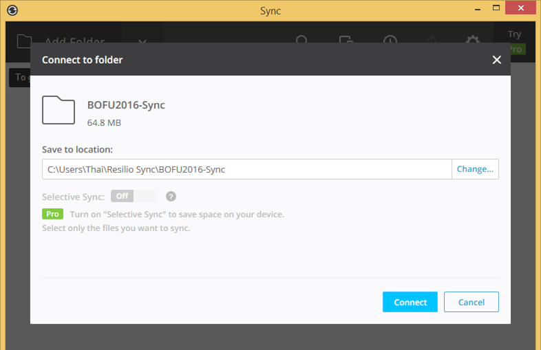
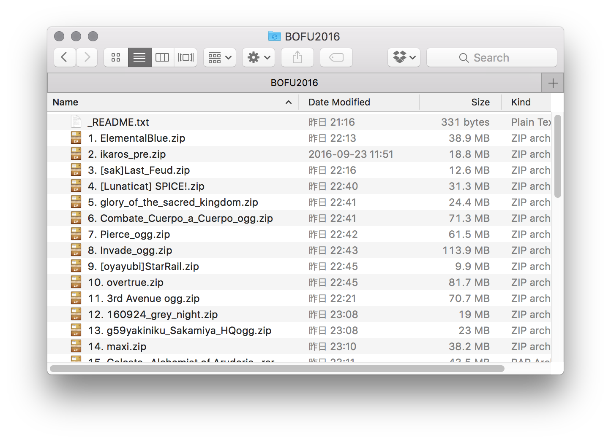

# BOFU2016 Unofficial Sync Project

このプロジェクトは、Resilio Syncを使用してBOFU2016パッケージを迅速に提供することを目的としています。

This project aims to distribute BOFU2016 packages with synchronization technology, using [Resilio Sync](https://getsync.com/individuals/).
Using Sync, we can release the package early.
As more songs are published, they are added to the distribution and synchronized to everyone!

## How to download?

1. 以下のリンクをクリック

   Please click the button:

   
<a href="https://link.getsync.com/#f=BOFU2016&amp;sz=11E9&amp;t=2&amp;s=VI5S7SMEBYU6U3JDQ4VAFDPFNZN7QPRJFAWKM7VPYK3IPEKJOOBQ&amp;i=CY5QZIN5G6AOC4V2J6ZCARNADD7JB6SPP&amp;v=2.4" class="dl">Synchronize Package</a>

2. Resilio Syncをインストールし、コンピュータ内の同期するフォルダを選択

   If you don’t have Resilio Sync, please install it.
   Then select a folder on your computer where to save the packages.

   <small>The company “Resilio, Inc.” was [spun out of BitTorrent, Inc.](https://getsync.com/about/), the owner of μTorrent.
   Resilio Sync allows folders to be synchronized using peer-to-peer technology,
   so there is no storage or transfer limit.</small>

   

3. コンピューターの指定のフォルダが同期され、BOFU2016の楽曲がそのフォルダに入ってきます

   The available files will be synchronized into your computer.

   

4. 楽曲が追加されれば、随時同期されます

   As more packages are published, they will be synchronized to your computer.

## Contributors

Package compiled by:

- [flicknote (@bemusegame)](https://twitter.com/bemusegame)

- [Dolphin (@Dolphinsssz)](https://twitter.com/Dolphinsssz)

- [@GoaLitiuM](https://twitter.com/GoaLitiuM)

- Arras

Project page translated into Japanese by:

- [@exch_059418](https://twitter.com/exch_059418).

## Reporting package revision / errors

If there are any error in this package, please contact us through Twitter.
We are also on [BMS Chat on Discord](https://discordapp.com/invite/0lUN07Rj1O8Sdctv).

