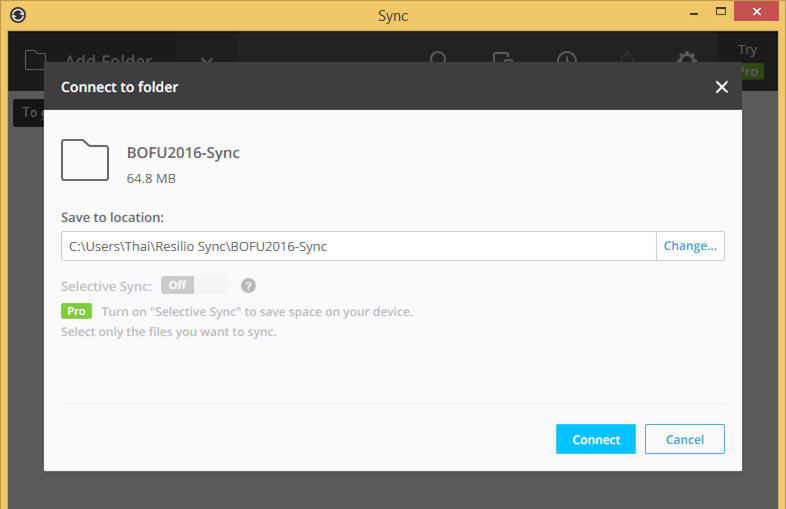
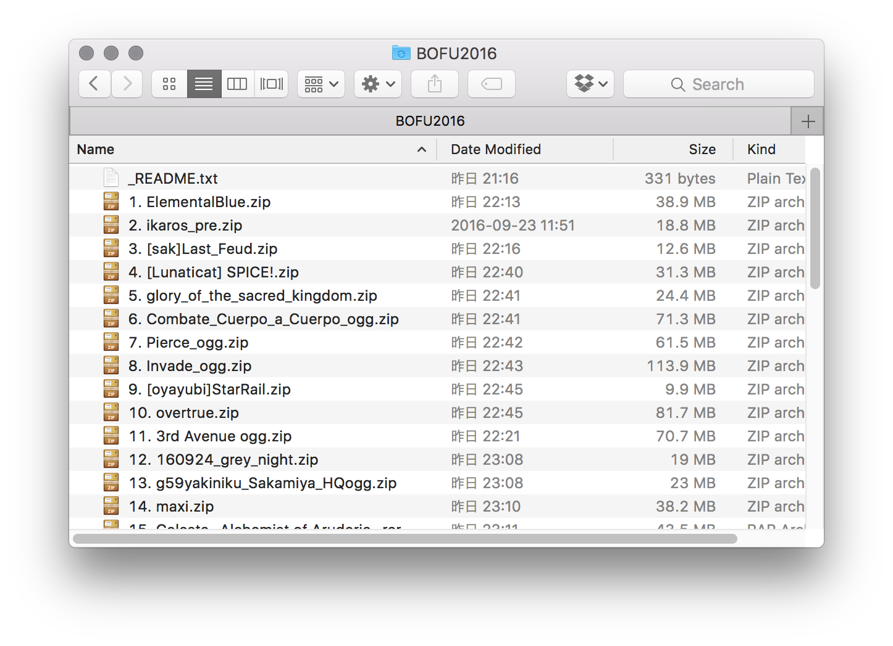

# BOFU2017 Unofficial Sync Project

このプロジェクトは、Resilio Syncを使用してBOFU2017パッケージを迅速に提供することを目的としています。

본 프로젝트는 Resilio Sync를 활용하여 BOFU2017의 악곡 패키지들을 배포하는 것을 목적으로 진행됩니다. 차후 추가되는 악곡들 또한 Sync에 추가 및 동기화할 예정입니다.

This project aims to distribute BOFU2017 packages with synchronization technology, using [Resilio Sync](https://getsync.com/individuals/).
With Sync, we can release the package early.
As more songs are published, they are added to the distribution and synchronized to everyone!

## How to download?

1. 以下のリンクをクリック

   아래 링크를 클릭해주시기 바랍니다.

   Please click the button:

   
<a href="https://link.resilio.com/#f=BOFU2017&amp;t=1&amp;s=63CXW7NCWBLOJTN56QAWBIGCVFYRRBJL&amp;i=CEDJZY5VNWRVZRAISL6SDFVTTK5ZRAXCZ&amp;v=2.5" class="dl">Synchronize Package <small>Original package</small></a>

   
<small>Sync key: <strong>BIIS2USK6VG2WB6MAUG4V4FIYEJI32TQ3</strong></small>

   
<small>The <strong>original packages</strong> contains the originally uploaded files.</small>

   Or this button:

   
<a href="https://link.resilio.com/#f=BOFU2017-normalized&amp;sz=0&amp;t=1&amp;s=RG5TQXBI6B7J2LCX2BYHISQRCO6ESHTS&amp;i=CIZCRJ62DPYSXUUBQ6NFWYMHEVH3OD6EV&amp;v=2.5" class="dl">Synchronize Package <small>Normalized (OGG) package</small></a>

   
<small>Sync key: <strong>B3W3WWZEDB5SVISHYKNZGFQBMMLH3Q23F</strong></small>

   
<small>The <strong>normalized packages</strong> are repacked as ZIP files with consistent folder structure. All WAV files are converted into OGG. Total size is 50% smaller.</small>

   
<small><strong>Note:</strong> These packages are automatically converted. Some files may not convert properly. In case of error, please send a message to @bemusegame.</small>

2. Resilio Syncをインストールし、コンピュータ内の同期するフォルダを選択

   Resilio Sync가 없을 경우 먼저 설치해주세요. 설치 후 패키지를 어떤 경로에 저장할 것인지 설정하시기 바랍니다.

   If you don’t have Resilio Sync, please install it.
   Then select a folder on your computer where to save the packages.

   <small>The company “Resilio, Inc.” was [spun out of BitTorrent, Inc.](https://getsync.com/about/), the owner of μTorrent.
   Resilio Sync allows folders to be synchronized using peer-to-peer technology,
   so there is no storage or transfer limit.</small>

   

3. コンピューターの指定のフォルダが同期され、BOFU2017の楽曲がそのフォルダに入ってきます

   이용 가능한 파일들이 컴퓨터에서 설정한 폴더 내에서 동기화될 것입니다.

   The available files will be synchronized into your computer.

   

4. 楽曲が追加されれば、随時同期されます

   악곡 패키지가 추가적으로 게시된다면 그 패키지 역시 동기화됩니다.

   As more packages are published, they will be synchronized to your computer.

## Status

<iframe width="100%" height="480" frameborder="0" src="https://docs.google.com/spreadsheets/d/e/2PACX-1vTABIB-azCSmNT0bTK88DNJkRC1GSm0YQtwtHn4tneTUzD1iYc_U1v_P19EGRyd4l9VJbhwJyVeEz2y/pubhtml?widget=true&amp;headers=false"></iframe>

## Contributors

Package compiled by:

- [flicknote (@bemusegame)](https://twitter.com/bemusegame)

- [AYhaz (@AYYYhaz)](https://twitter.com/AYYYhaz)

- [@GoaLitiuM](https://twitter.com/GoaLitiuM)

Project page translated into Japanese by:

- [@exch_059418](https://twitter.com/exch_059418).

Project page translated into Korean by:

- [@auth_](https://twitter.com/auth_).

## Reporting package revision / errors

If there are any error in this package, please send a message to [@bemusegame](https://twitter.com/bemusegame).

## Archive Extraction

Most archives are downloaded as-is. Therefore, __some archives may not contain folders.__ The BMS community has published some tools and articles (ありがとう！):

- [@5argondesu’s](https://twitter.com/5argondesu/status/783980436003237888) [article: ダウンロードされたBMSのzipファイルを複数展開方法](http://qiita.com/5argon/items/cc7d7d9a652f57589674)

- [@Dolphinsssz’s tweet recommends using Bandizip](https://twitter.com/Dolphinsssz/status/783047901949952000)
